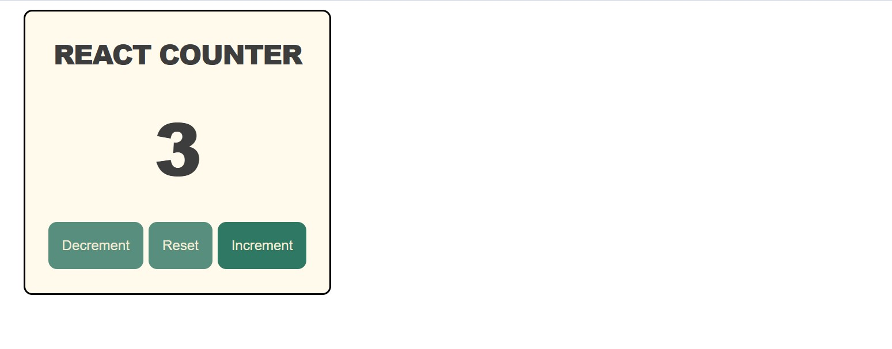
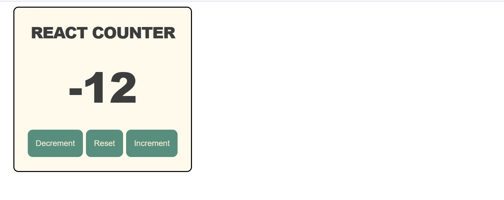

# React Counter Project  

A simple counter application built with React, demonstrating the use of the `useState` hook for managing state.  

## Description  
I have created a counter project using React.js. This project demonstrates the use of React.js hooks, such as `useState`, to manage values. The application includes three buttons: **Increment**, **Reset**, and **Decrement**. Using these buttons, users can interact with the counter, and the output is displayed dynamically in one frame. This project demonstrates simple and dynamic UI design of the React Counter Project created using CSS styles. 

## Screenshots    

  
  
